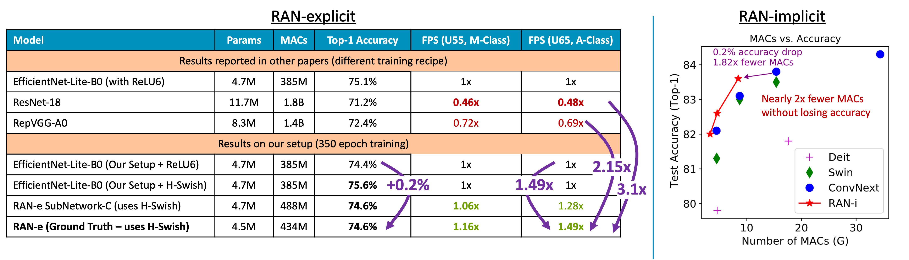

# RANs
Official code to train and evaluate, as well as the pretrained models for [Restructurable Activation Networks](https://arxiv.org/abs/2208.08562).

Restructurable Activation Networks (RANs) achieve state-of-the-art accuracy on ImageNet across multiple scales and multiple types of hardware ranging from micro-NPUs to datacenter CPUs.

### Directories

- `RAN_e/` contains code for RAN-explicit
- `RAN_i/` contains code for RAN-implicit
- `pretrained/` contains the pretrained weights for these models




## Pretrained Weights
> Note: by default, cloning this repo will not download the pretrained weights.

Due to their large size, [git-lfs](https://git-lfs.github.com/) is used to assign pointers to the weights files by default.
In order to download the actual weights, first ensure you have _git-lfs_ installed, then run one of the following shell commands.

```bash
git lfs pull --include=pretrained/RAN_i_pretrained/img_cls_imagenet/  # To only download the RAN-i image-classification weights
git lfs pull                                                          # To download all the pretrained weights
```

## Reference

If you find this work useful, please consider citing our paper:

```
@article{bhardwaj2022restructurable,
  title={Restructurable Activation Networks},
  author={Bhardwaj, Kartikeya and Ward, James and Tung, Caleb and Gope, Dibakar and Meng, Lingchuan and Fedorov, Igor and Chalfin, Alex and Whatmough, Paul and Loh, Danny},
  journal={arXiv preprint arXiv:2208.08562},
  year={2022}
}
```

## Other Resources

- _Collapsible Linear Blocks for Super-Efficient Super Resolution_ (MLSys 2022) \[[ code ](https://github.com/ARM-software/sesr) \]  \[[ paper ](https://arxiv.org/abs/2103.09404)\]
- _How does topology influence gradient propagation and model performance of deep networks with DenseNet-type skip connections?_ (CVPR 2021) \[[ code ](https://github.com/SLDGroup/NN_Mass) \]  \[[ paper ](https://arxiv.org/abs/1910.00780)\]
- _Super-Efficient Super Resolution for Fast Adversarial Defense at the Edge_ (DATE 2022) \[[ paper ](https://arxiv.org/abs/2112.14340)\]

```
@article{bhardwaj2022collapsible,
  title={Collapsible linear blocks for super-efficient super resolution},
  author={Bhardwaj, Kartikeya and Milosavljevic, Milos and O'Neil, Liam and Gope, Dibakar and Matas, Ramon and Chalfin, Alex and Suda, Naveen and Meng, Lingchuan and Loh, Danny},
  journal={Proceedings of Machine Learning and Systems},
  volume={4},
  pages={529--547},
  year={2022}
}
```

```
@inproceedings{bhardwaj2021does,
  title={How does topology influence gradient propagation and model performance of deep networks with DenseNet-type skip connections?},
  author={Bhardwaj, Kartikeya and Li, Guihong and Marculescu, Radu},
  booktitle={Proceedings of the IEEE/CVF Conference on Computer Vision and Pattern Recognition},
  pages={13498--13507},
  year={2021}
}
```

```
@inproceedings{bhardwaj2022super,
  title={Super-efficient super resolution for fast adversarial defense at the edge},
  author={Bhardwaj, Kartikeya and Gope, Dibakar and Ward, James and Whatmough, Paul and Loh, Danny},
  booktitle={2022 Design, Automation \& Test in Europe Conference \& Exhibition (DATE)},
  pages={418--423},
  year={2022},
  organization={IEEE}
}
```